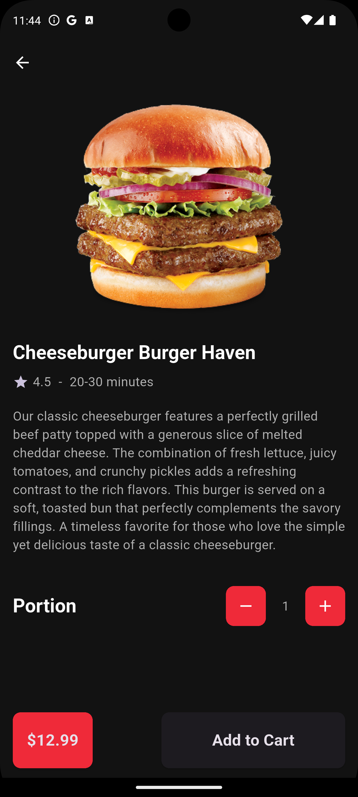
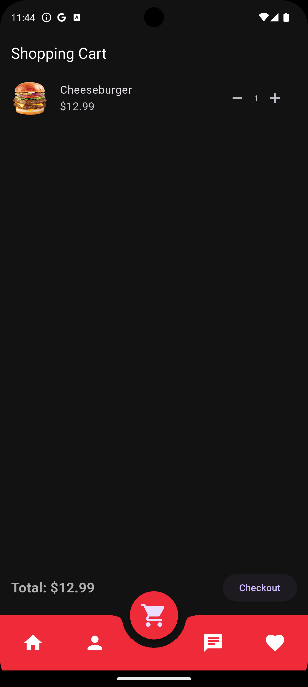
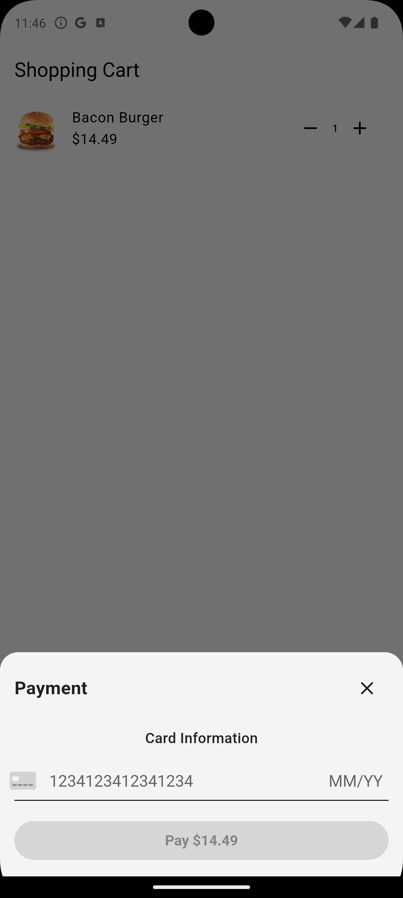
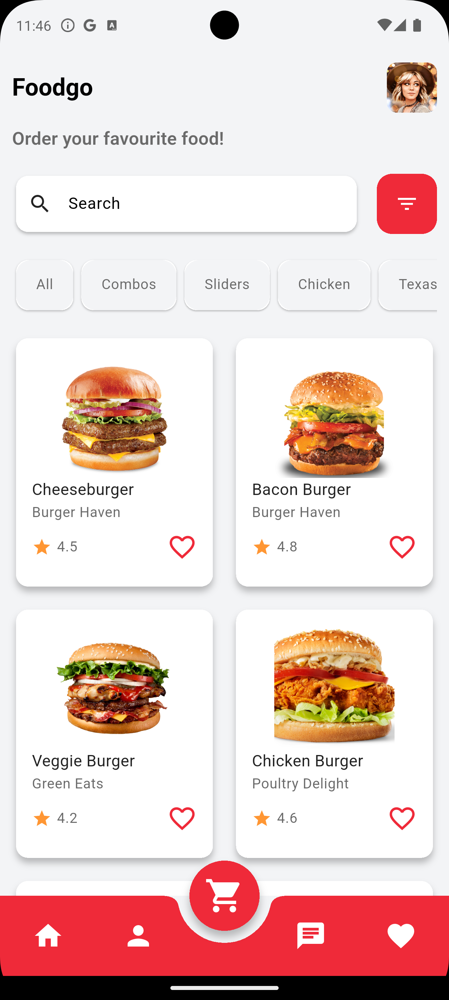
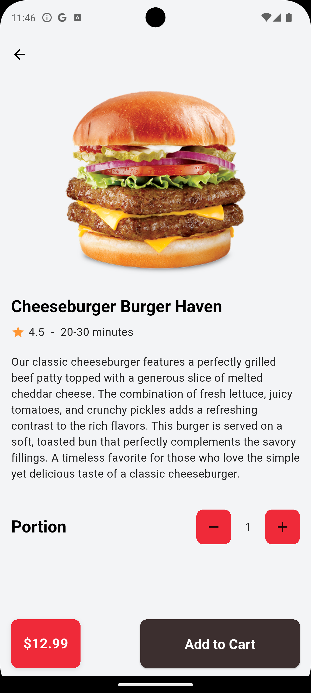
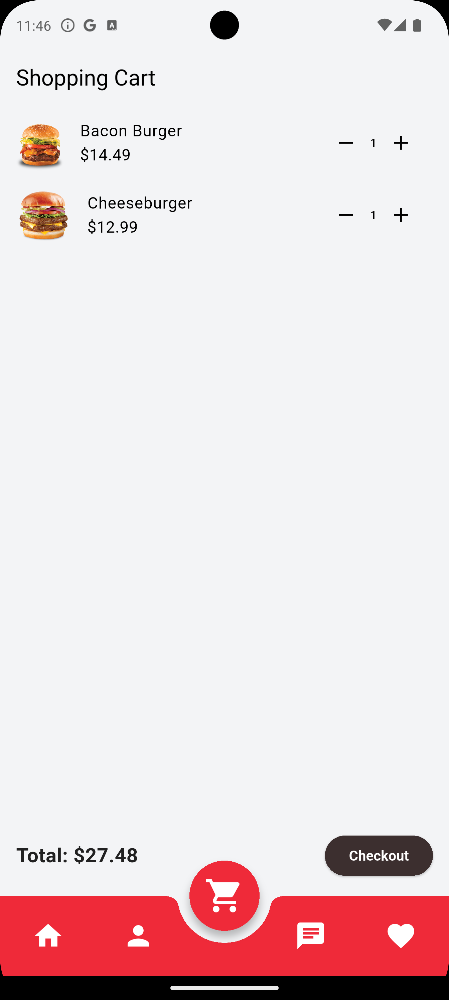
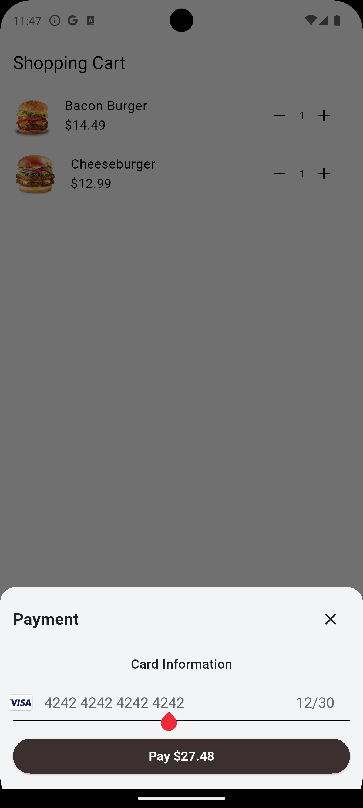
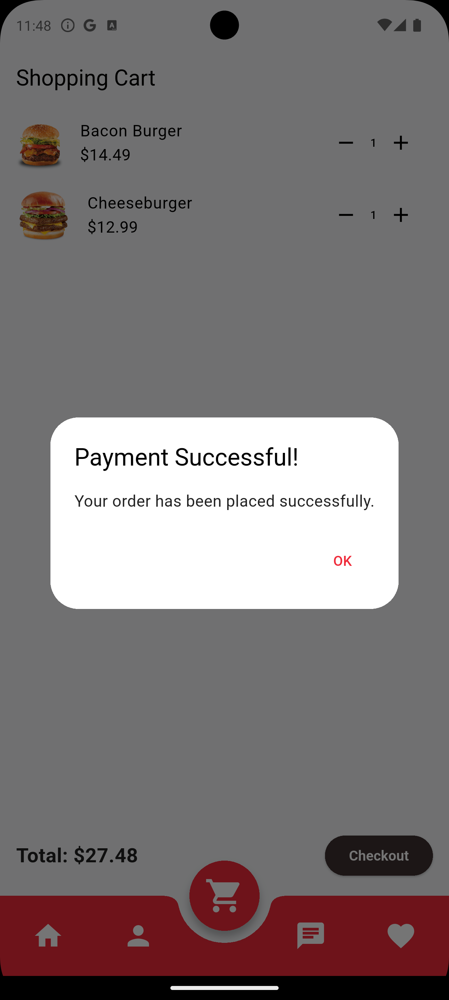

# 🍔 MyBurger

**MyBurger** is a Flutter-based burger ordering application where users can choose from pre-defined burgers, specify quantities, and securely complete their payments via **Stripe**. The entire app flow is managed with **Bloc** architecture to ensure scalability and clean code structure.

## ✨ Features

- Select from a variety of ready-made burgers
- Adjust quantity and view dynamic cart updates
- Secure payments using Stripe
- Responsive and modern UI
- Support for both **Light** and **Dark** themes 🌗

## 📸 Screenshots

### 🌓 Light Theme





### 🌑 Dark Theme





## 🛠️ Technologies Used

- Flutter
- Bloc (State Management)
- Stripe Payment Integration

## 🚀 Getting Started

1. Clone the repository:
   ```bash
   git clone https://github.com/your-username/myburger.git
